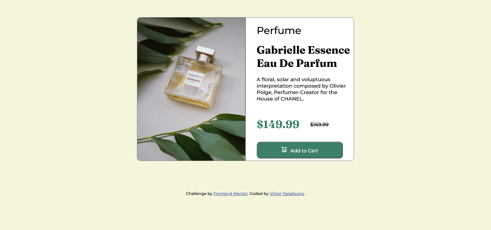

## Table of contents

- [Overview](#overview)
  - [Screenshot](#screenshot)
  - [Links](#links)
  - [Built with](#built-with)
  - [What I learned](#what-i-learned)
  - [Continued development](#continued-development)
- [Author](#author)

## Overview

### Screenshot

### Links

- Solution URL: [https://github.com/Victoryara/Product-Preview-Card.git](https://github.com/Victoryara/Product-Preview-Card.git)
- Live Site URL: [https://victoryara.github.io/Product-Preview-Card/](https://victoryara.github.io/Product-Preview-Card/)

### Built with

- HTML
- CSS 
- Grid and Flexbox 
- Media Queries 

### What I learned

I learned how powerful was a simple chatGPT or Google search. It has helped me to implement the media queries for my website to adapt on smaller screens.

### Continued development

I want to improve my skills in those areas below:
-CSS Flexbox
-CSS Grid
-Boostrap

## Author

- Website - [https://github.com/Victoryara](https://github.com/Victoryara)
- Frontend Mentor - [@Victoryara](https://github.com/Victoryara)
- Twitter - [@Victoryara2](https://www.frontendmentor.io/profile/Victoryara)

## Conclusion 

Overall, this project was a great opportunity to practice my HTML and CSS skills, as well as to learn more about responsive design using media queries. I am proud of the final product and feel that it is a great representation of my abilities.

